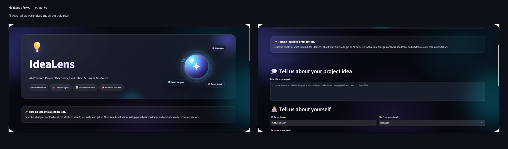
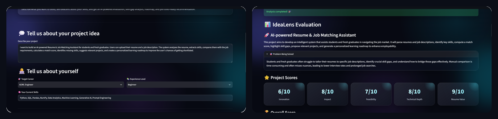
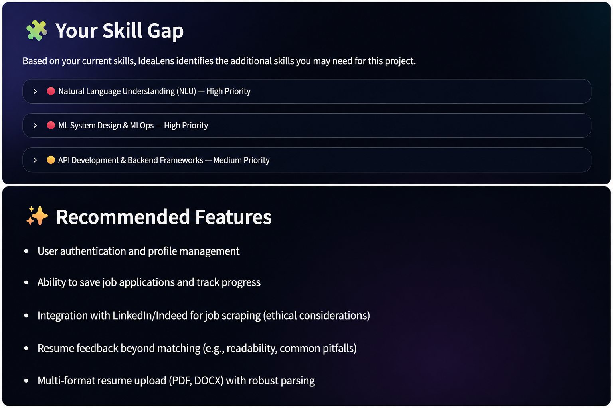

# 🚀 IdeaLens

### AI-Powered Project Discovery, Evaluation & Career Guidance

IdeaLens is an AI-powered web application that helps students and aspiring AI/ML engineers discover, evaluate, and compare project ideas based on their career goals, experience level, and existing skills.

It uses Generative AI to provide personalized project evaluations, skill-gap analysis, learning recommendations, and career-focused guidance.

---

## ✨ Features

### 🤖 AI-Powered Project Analysis

Describe a project idea and provide your career goal, experience level, and current skills.

IdeaLens generates:

- Project overview
- Problem being solved
- Innovation score
- Impact score
- Feasibility score
- Technical depth score
- Resume value score
- Overall evaluation

### 🧩 Skill Gap Analysis

Identify the skills you may need to strengthen for your target project or career.

The application provides:

- High-priority skill gaps
- Medium-priority skill gaps
- Recommended features
- Learning and development directions

### ⚖️ Project Comparison

Compare two project ideas and determine which one is stronger based on:

- Innovation
- Impact
- Feasibility
- Technical depth
- Resume value
- Overall score

IdeaLens provides an AI-generated recommendation to help users choose the better project.

### 🎯 Career-Focused Recommendations

Project recommendations are tailored according to:

- Career goal
- Current skills
- Experience level
- AI/ML interests

---

## 🛠️ Tech Stack

- Python
- Streamlit
- Generative AI
- Prompt Engineering
- Git & GitHub

---

## 📸 Screenshots

### 🏠 Home

### 📊 AI-Powered Evaluation

### 🧩 Skill Gap Analysis

### ⚖️ Project Comparison

---

## 📁 Project Structure

    IdeaLens/
    ├── app.py
    ├── requirements.txt
    ├── README.md
    ├── .gitignore
    └── screenshots/
        ├── home.png
        ├── evaluation.png
        ├── skill-gap.png
        └── comparison.png

---

## 🌐 Live Demo

👉 [Try IdeaLens Live](https://idealens.streamlit.app/)

---

## 🎯 Project Goal

IdeaLens is designed to help students and aspiring AI/ML engineers move from simply having project ideas to making informed decisions about what to build.

By combining project evaluation, skill-gap analysis, comparison, and career-focused recommendations, the application helps users build projects that are both technically meaningful and valuable for their portfolios.

---

## 🚀 Future Improvements

- Resume upload and automated resume analysis
- Job-description and resume matching
- Personalized learning roadmaps
- User profile and progress tracking
- GitHub and LinkedIn integration
- More advanced AI/ML career recommendations
- Project history and saved analyses

---

## 👩‍💻 Author

**Praneetha Gorle**

AI/ML & Generative AI Enthusiast

---

⭐ If you find IdeaLens interesting, consider giving the repository a star!
