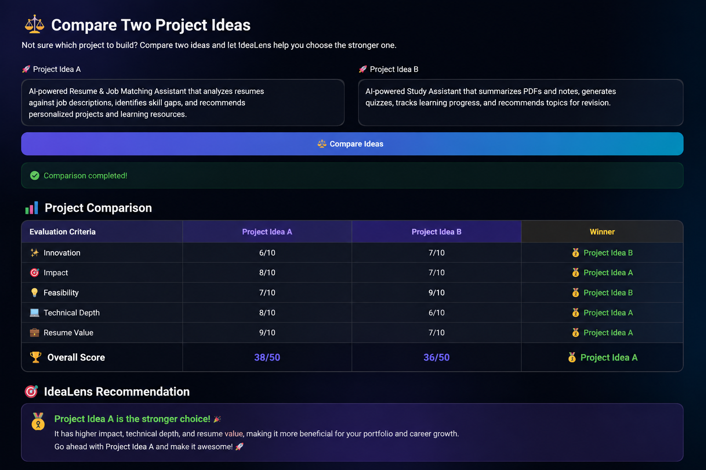

# 🚀 IdeaLens

### AI-Powered Project Discovery, Evaluation & Career Guidance

IdeaLens is an AI-powered web application that helps students and aspiring AI/ML engineers discover, evaluate, and compare project ideas based on their career goals, experience level, and existing skills.

Instead of simply generating project ideas, IdeaLens helps users understand whether an idea is worth building, what skills it requires, where their skill gaps are, and what they can learn next.

---

## 🌐 Live Demo

👉 [Try IdeaLens Live](https://idealens.streamlit.app/)

---

## 💡 Why I Built IdeaLens

Choosing a project can sometimes be harder than building one.

There are thousands of project ideas available, but choosing one that matches your skills, career goals, learning needs, and portfolio goals can be challenging.

I built IdeaLens to make that decision more informed and practical.

---

## ✨ Features

### 🤖 AI-Powered Project Analysis

Describe your project idea and provide your:

- Career goal
- Experience level
- Current skills

IdeaLens generates an evaluation including:

- Project overview
- Problem being solved
- Innovation score
- Impact score
- Feasibility score
- Technical depth score
- Resume value score
- Overall evaluation

### 🧩 Skill Gap Analysis

Identify the skills you may need to strengthen for your target project or career.

IdeaLens provides:

- 🔴 High-priority skill gaps
- 🟡 Medium-priority skill gaps
- 🟢 Lower-priority areas
- Recommended features
- Learning and development directions

### ⚖️ Project Comparison

Compare two project ideas based on:

- Innovation
- Impact
- Feasibility
- Technical depth
- Resume value
- Overall score

IdeaLens also provides an AI-generated recommendation to help users choose between the two ideas.

### 🎯 Career-Focused Recommendations

Recommendations are tailored according to:

- Career goal
- Current skills
- Experience level
- AI/ML interests

---

## 🔄 How It Works

Project Idea → Career & Experience Details → Current Skills → AI Analysis → Project Evaluation → Skill Gap Analysis → Learning Recommendations → Project Comparison

---

## 🛠️ Tech Stack

- 🐍 Python
- 🎈 Streamlit
- 🤖 Generative AI
- ✨ Prompt Engineering
- 🔧 Git & GitHub

---

## 📸 Screenshots

### 🏠 Home

### 📊 AI-Powered Evaluation

### 🧩 Skill Gap Analysis

### ⚖️ Project Comparison

---

## 🎯 Project Goal

The goal of IdeaLens is to help students and aspiring AI/ML engineers move from simply having project ideas to making informed decisions about what to build.

By combining project evaluation, skill-gap analysis, project comparison, and career-focused recommendations, IdeaLens helps users choose projects that are both technically meaningful and valuable for their learning and portfolios.

---

## 🚀 Future Improvements

- 📄 Resume upload and automated resume analysis
- 🎯 Job description and resume matching
- 📚 Personalized learning roadmaps
- 📈 User profile and progress tracking
- 🔗 GitHub and LinkedIn integration
- 🤖 More advanced AI/ML career recommendations
- 💾 Project history and saved analyses

---

## 📁 Project Structure

IdeaLens/
├── app.py
├── requirements.txt
├── README.md
├── .gitignore
└── screenshots/
    ├── home.png
    ├── evaluation.png
    ├── skill-gap.png
    └── comparision.png

---

## 👩‍💻 Author

**Praneetha Gorle**

AI/ML & Generative AI Enthusiast

---

⭐ If you find IdeaLens interesting, consider giving the repository a star!
